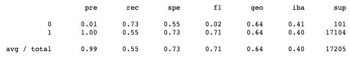
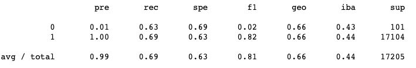
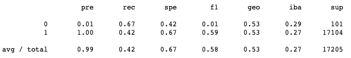
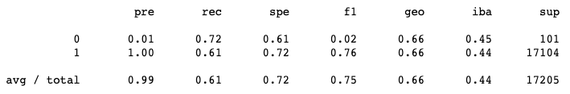
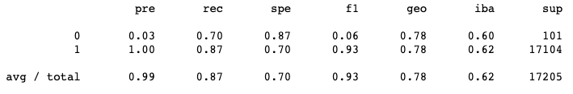
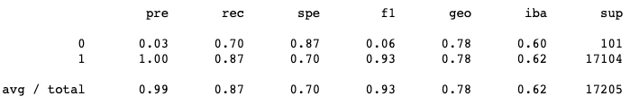

# Credit_Risk_Analysis

## Project Overview

The purpose of this project is to determine which sampling model performs best in predicting the credit risk level of credit card applicants. We are using a dataset provided by LendingClub which provides all kinds of attributes on each credit card applicant and we will determine which model performs best based on the following attributes: 

- Balanced Accuracy Score - How accurately (in %age) does the model produce the proper credit risk assessment
- Precision Score - What percentage of the time the model correctly predicts that an applicant is a low-risk one when the applicant actually is a low-risk candidate versus predicting the applicant is low-risk while they're in fact a high-risk candidate.
- Recall Score - What percentage of the time the model correctly predicts that an applicant is a low-risk candidate while the applicant is a low-risk candidate versus predicting the applicant is high-risk while they're in fact a low-risk candidate.

## Results

As you will see, we ran 6 different types of learning methods about the data and here are the results we came up with. Values that we will primarily will rip from the set of imbalanced classification reports are what we outlined above. They will correspond with each 'pre', 'rec', and 'geo' value set. Here are our results below with the set of methodology used. 

#### Naive Random Oversampling

Precision: 0.99
Recall: 0.55
Balanced Accuracy Score: 0.64

###### Imbalanced Classification Report

#### SMOTE Oversampling

Precision: 0.99
Recall: 0.69
Balanced Accuracy Score: 0.66

###### Imbalanced Classification Report

#### ClusterCentroids Undersampling

Precision: 0.99
Recall: 0.42
Balanced Accuracy Score: 0.53

###### Imbalanced Classification Report

#### SMOTEENN, a mix of over and undersampling

Precision: 0.99
Recall: 0.61
Balanced Accuracy Score: 0.66

###### Imbalanced Classification Report

#### Balanced Random Forest Classifier

Precision: 0.99
Recall: 0.87
Balanced Accuracy Score: 0.78

###### Imbalanced Classification Report

#### Easy Ensemble AdaBoost Classifier

Precision: 0.99
Recall: 0.87
Balanced Accuracy Score: 0.78

###### Imbalanced Classification Report

## Summary

Upon reviewing all of the methods that we used about this data, precision was high in all cases. However, when it came to recall and balanced accuracy scores, the best performers of these categories would be for our Ensemble methods, Balanced Random Forest and Easy Ensemble Classifiers. These particular tests came in with high recall values of 0.87 and a balanced accuracy score of 0.78, showing more significantly higher marks than the alternative sampling methods. If we want to ensure the best accuracy in our screening process of credit card applicants, these Ensemble methods are the way to go.

The worst performer of the lot would have to be with the Cluster Centroids undersampling process. It seems the disparity between the majority and minority data sets definitely showed when shrinking down the size of applicants that posed a low risk on their credit rating. 
